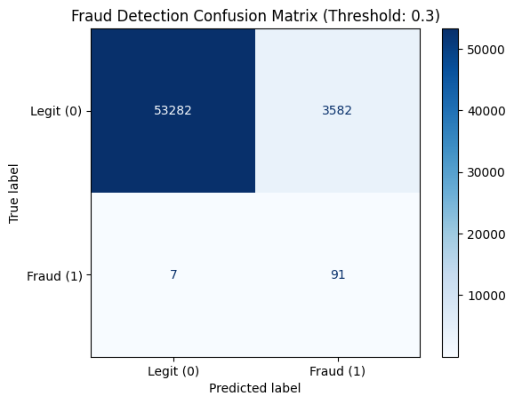
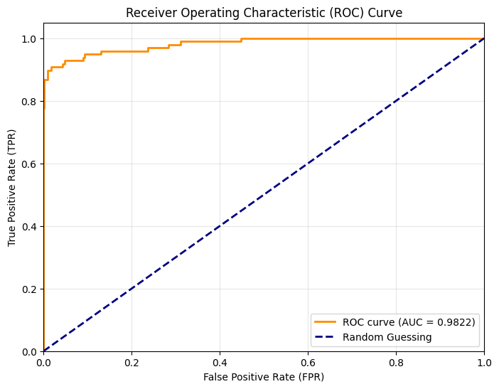

# 🕵️‍♂️ Credit Card Fraud Detection (Imbalanced Data Classifier)

An end-to-end Machine Learning project focused on detecting fraudulent credit card transactions. This project tackles the severe challenge of highly imbalanced data (where frauds account for less than 0.2% of all transactions) using a custom **Logistic Regression model built entirely from scratch** in Python.

## 🚀 Project Overview
Credit card fraud detection is a classic anomaly detection problem. Because legitimate transactions vastly outnumber fraudulent ones, standard metrics like "Accuracy" are misleading and useless. This project bypasses standard library crutches to implement **Precision, Recall, F1-Score, and customized Weighted Cost Functions** to correctly identify fraudulent patterns without blocking too many legitimate customers.

## 🛠️ Tech Stack
* **Language:** Python
* **Libraries:** NumPy (Core Math/Vectorization), Pandas (Data Manipulation), Matplotlib & Seaborn (Visualization), Scikit-Learn (Evaluation metrics & Data splitting only)
* **Core Algorithm:** Logistic Regression (Custom implementation from scratch)

## 🧠 Key Features & Mathematical Underpinnings
* **Built From Scratch:** Implemented Logistic Regression completely using NumPy. This includes a custom Gradient Descent optimizer and a vectorized Sigmoid activation function.
* **Binary Log Loss (Cross-Entropy):** Instead of using standard Mean Squared Error (which causes non-convex cost functions in classification), the model optimizes the Binary Log Loss function to calculate the error between predicted probabilities and actual classes.
* **Imbalanced Data Handling (Weighted Loss):** To prevent the model from ignoring the rare fraud cases, I modified the standard Binary Log Loss function to include class weights. It assigns a higher weight ($w_1$) to fraud cases and a lower weight ($w_0$) to legitimate ones.
  * **Custom Cost Formula:** $$J = -\frac{1}{n} \sum [w_1 \cdot y \log(\hat{y}) + w_0 \cdot (1-y) \log(1-\hat{y})]$$
* **Z-Score Normalization:** Scaled features like 'Amount' and 'Time' to match the PCA-transformed 'V1-V28' features, ensuring a spherical cost function and faster gradient descent convergence.

## 📊 Model Evaluation & Results
Because this dataset is highly skewed (0.17% fraud), the model was evaluated using metrics specifically suited for imbalanced classes:

* **Confusion Matrix:** Visualizes the trade-off between False Positives (flagging a normal transaction) and False Negatives (missing a fraudulent one).
* **Precision & Recall:** * *Precision:* Out of all transactions flagged as fraud, how many were actually fraud?
  * *Recall:* Out of all actual frauds, how many did we successfully catch?
* **ROC-AUC Score:** Evaluated the model's ability to distinguish between the positive and negative classes across various threshold settings.

### Visualizing the Performance
*(Note: These visualizations were generated directly from the model's predictions on the unseen test set.)*

**Confusion Matrix**

**ROC-AUC Curve**

## 📉 Training Convergence
To verify the custom Gradient Descent implementation, the Cost Function was tracked across iterations. The steady decay of the loss curve confirms that the optimization algorithm successfully converged to a global minimum without overshooting, validating the chosen learning rate ($\alpha$).

## 💼 Business Application & Threshold Tuning
The standard classification threshold of $0.5$ is not optimal for real-world fraud detection. A false negative (missing a fraudulent transaction) costs a bank significantly more than a false positive (temporarily declining a legitimate transaction). 
By analyzing the Precision-Recall curve, the decision threshold in this project was lowered to maximize Recall, ensuring the vast majority of fraud is caught while keeping false alarms at an acceptable business level.

---
